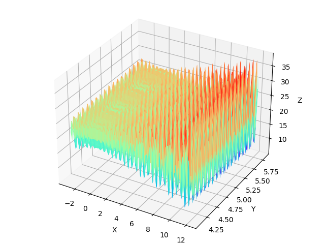
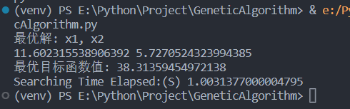

# GeneticAlgorithm
The first course assignment of Intelligent Optimization Algorithm.

## The assignment requests:
Implement a genetic algorithm program to solve continuous function problems and investigate algorithm parameters and write a report. Solve problem:

Find the max value of the function:  f(x1,x2)=21.5+x1*sin(4*pi*x1)+x2*sin(20*pi*x2)

Parameter setting: N=100, pc=0.7, pm=0.07, Gmax=2000 Investigate parameters pc and pm (control variables), respectively set pc=0.1,0.2,0.3….,0.9；pm=0.01,0.02， 0.03，…0.09，run each parameter combination on the function 30 times, based on 30 times average results for report writing.

## The 3D graph of the function:
By running the Graph.py,we can create the 3D graph of this function via matplotlib:

according to this graph,we can find that:

From the 3D image of the function generated by matplotlib, it can be seen that this function seems to have some periodicity, which is closely related to the sin value, and by observing the z-axis, it can be found that the maximum value is between 38 and 40 while there are plenty potential the best solutions.

## Results:
Base on the requirement of this assignment,the max iter set to Gmax=2000, the group size set to N=100,crossover probability set to PC=0.7, mutation probability set to PM=0.07

the solution is:
x1:11.602315538906392, x2:5.7270524323994385,fx:38.31359454972138

## Parameter investigation
